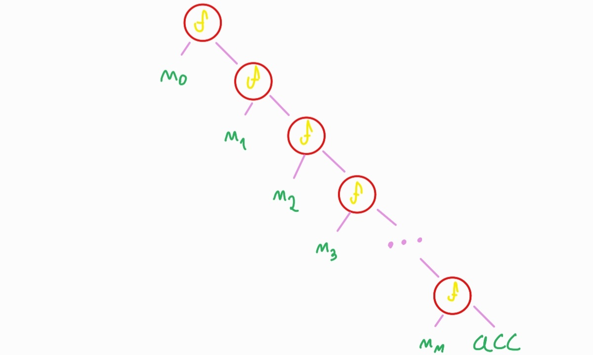
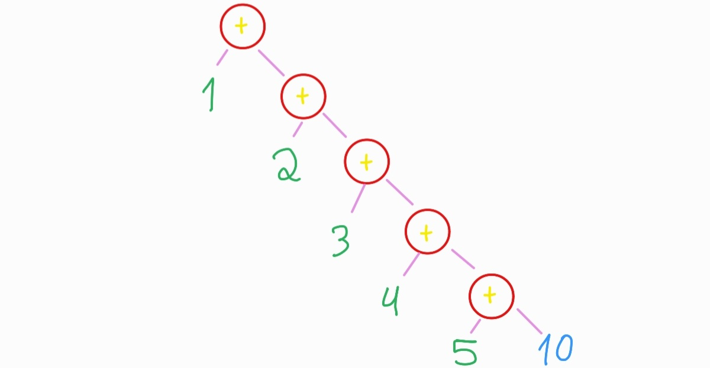
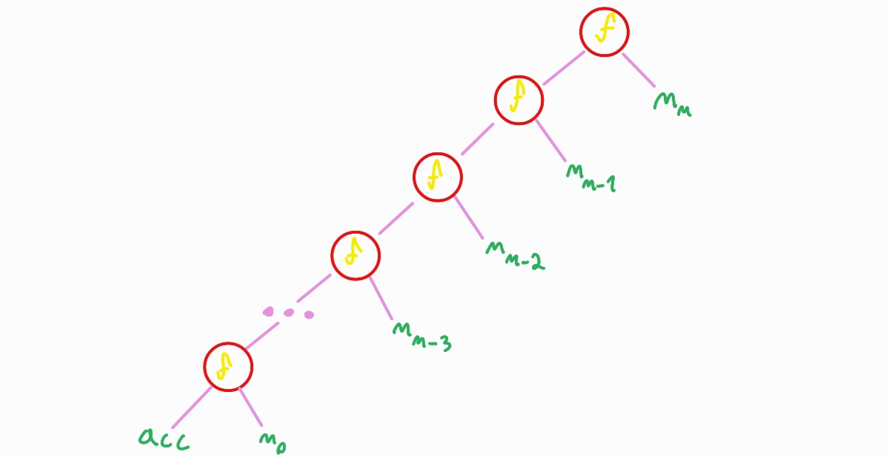
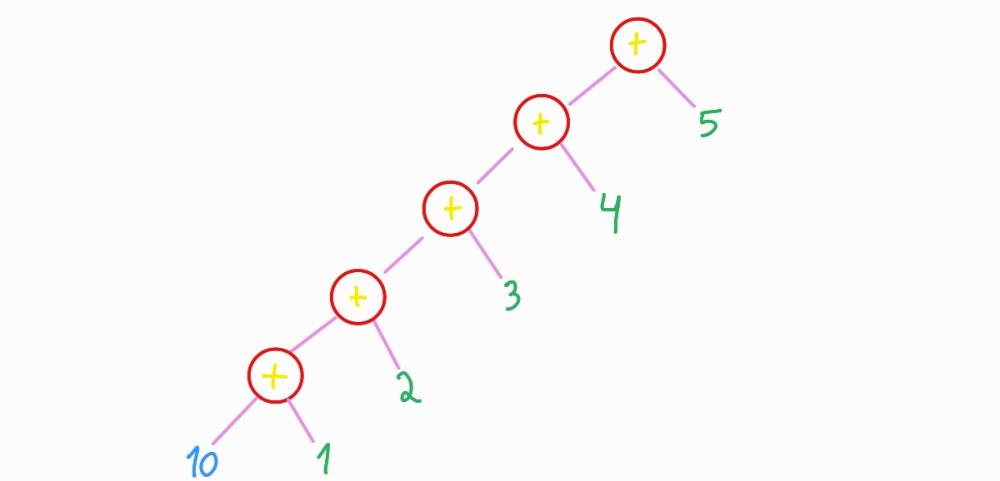

# 9. Funções de alta ordem pt.3


## 9.1 Funções `fold`

As funções `fold` estão definidas em um módulo que faz parte da biblioteca padrão do haskell e uma característica muito chamativa deste modulo é que todas as funções contidas nele são bastante similares entre sí, mas existem duas funções que servem como arquetipo para as demais: `foldr` e `foldl` e é sobre elas que iremos estudar.

### 9.1.1 `foldr`

A ideia por trás dela é bastante simples e consiste que, dado uma função `f`, um valor acumulador `acc` e um conjunto `lista` de tamanho $n$, `foldr` retornará:

```haskell
n0 `f` n1 `f` n2 `f` n3 `f` ... `f` nn `f` acc
```

Caso `f` seja a função de soma `(+)`, observar o comportamento de `foldr` fica bastante simples:

```haskell
n0 + n1 + n2 + n3 + ... + nn + acc
```

De uma forma um pouco mais prática, o diagrama a seguir descreve bem o processamento de dados realizado por `foldr`.



No caso em que `f` corresponde à `(+)`, quando aplicado sobre a lista `[1..5]`, `foldr` funcionaria da seguinte maneira:



Na prática, essas ideias se traduzem da seguinte forma em haskell:<br><br>

```haskell
1. lista = [1..5]
2. acc = 10
3. f = (+)
>> foldr f acc lista
25
```

> **Note:** Para exemplificar o funcionamento de `foldr` no exemplo <<n0 + n1 + n2 + n3 + ... + nn + acc>>, foi realizado uma leitura em ordem da árvore.

> **Note:** Na literatura, é bastante comum que o valor numérico passado para foldr `acc` seja chamado de "acumulador", apesar de são inteiramente claro o porquê.

___

## 9.1.2 foldl

O `foldl` tem a mesma ideia que está por trás do `foldr`, a única diferença entre as duas é que, enquanto `foldr` é associativo à direita, `foldl` é associativo a esquerda. Observe o diagrama abaixo para entender melhor o funcionamento de `foldl`.



Adotando o mesmo exemplo que foi dado na explicação de `foldr`, temos:



Para operações que são associativas, isto é, para operações que tem a propriedade da ordem dos operandos não fazer diferença, como a soma e a multiplicação, `foldl` e `foldr` sempre produzirão o mesmo resultado quando aplicados sobre uma mesma lista e tiverem o mesmo acumulador.

No entanto, caso a operação não seja associativa, como é o caso da divisão, por exemplo, o resultados serão diferentes, mesmo que as listas e os acumuladores sejam iguais. Observe:

```haskell
>> foldr (/) 1 [10, 100, 1000, 10000, 100000]
1000.0
>> foldl (/) 1 [10, 100, 1000, 10000, 100000]
9.999999999999999e-16
```

## 9.2 Funções scan

As funções `scan` tem a mesma ideia das funções funções `fold` e, tal como as funções `fold`, as funções `scan` tem como marca registrada funções associativas à esquerda e a direita, neste caso, as funções `scanl` e `scanr`.

Essas funções são bastante similares as suas respectivas análogas de `fold`, com a diferença que, enquanto as funções `fold` retornam um único valor que representa toda a lista ao final de uma operação em série, como um somatório, ou um produtório, as funções `scan` retornam uma lista, cujo o i-ésimo elemento corresponderá a i-ésima operação da série. 

```haskell
scanl f acc [x1 .. xn]
```
corresponde à:
```haskell
[acc,
acc `f` x1,
(acc `f` x1) `f` x2,
((acc `f` x1) `f` x2) `f` x3,
...
((((acc `f` x1) `f` x2) `f` x3) `f` ...) `f` xn]
```

No exemplo de um somatório de 1 à 10, teríamos o seguinte código

```haskell
>> scanl (+) 0 [1..10]
[0,1,3,6,10,15,21,28,36,45,55]
```

Já no caso do scanr, teríamos o **_equivalente_** à :

```haskell
scanr f acc [x1 .. xn]
```
o que corresponde a:
```haskell
[((((acc `f` x1) `f` x2) `f` x3) `f` ...) `f` xn,
...
((acc `f` x1) `f` x2) `f` x3,
(acc `f` x1) `f` x2,
acc `f` x1,
acc]
```

Em um somátório de 1 até 10, teríamos o seguinte código:

```haskell
>>scanr (+) 0 [1..10]
[55,54,52,49,45,40,34,27,19,10,0]
```

## Referências

1. Thomson, Simon. Haskell - The craft of a functional programming language. 3ed. p.251-252
2. Apprenez Haskell Language, RIP tutorial, 2019, p. 76
3. Romildo, José. Programação Funcional em Haskell .UFOP.2018,p.178-179
4. https://hackage.haskell.org/package/base-4.20.0.1/docs/Prelude.html#v:foldl
5. https://hackage.haskell.org/package/base-4.20.0.1/docs/Prelude.html#v:scanl

## Sugestões de leitura

1. https://stackoverflow.com/questions/27074092/accumulator-in-foldr
